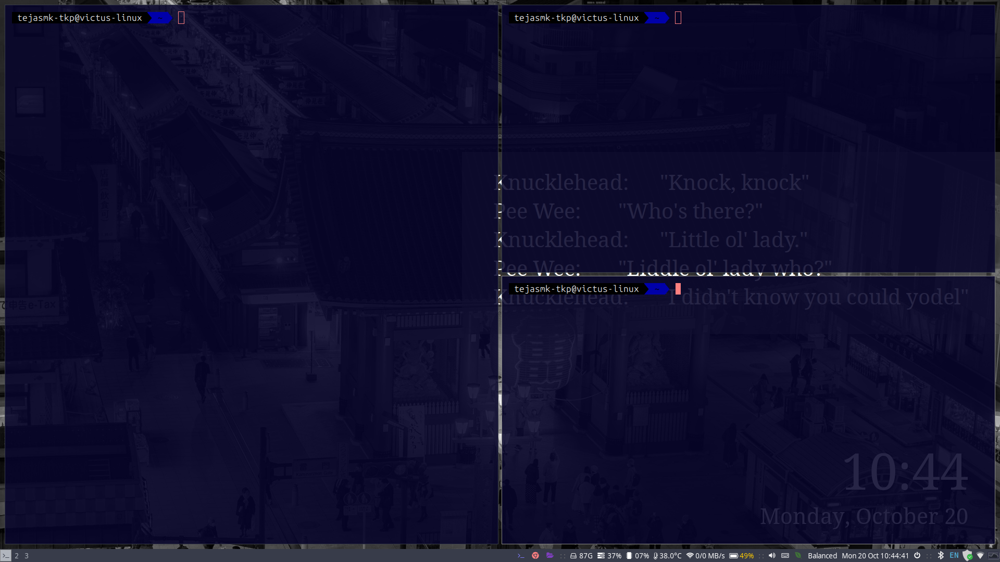

# Ubuntu Development Environment Setup Guide

A keyboard-centric, minimal, and efficient development environment — inspired by the EndeavourOS i3 setup, adapted for Ubuntu 22.04 LTS and Ubuntu 24.04 LTS.



This setup is designed to provide a clean and productive workflow suitable for ROS, Python, and general Linux-based development, focusing on simplicity, speed, and modularity.

## Features Overview

- Window Manager: i3 — lightweight, fast, and keyboard-driven
- Shell Environment: Zsh with Oh-My-Zsh and useful plugins
- Editor: Neovim configured for development productivity
- Clipboard Manager: Greenclip integration with Rofi
- Aesthetic Add-ons: Variety, Dunst, Picom, and Arc Theme
- Optimized for Developers: Python, Git, Docker, Virtualenv, and more preconfigured
- Custom Scripts and Configs: Easily reproducible setup via GitHub configs

---

## Prerequisites

Ensure you have Ubuntu 22.04 LTS or Ubuntu 24.04 LTS installed on your system.

**Important Note for Ubuntu 22.04 LTS Users:** The standard `apt` repository does not include `i3-gaps`. You will need to add the community repository during the i3 installation step (see Step 5.1 for instructions).

---

## Step 1: Install Git

### 1.1: Install Git

```bash
sudo snap install git
```

### 1.2: Configure Git

Replace the placeholder values with your actual GitHub username and email:

```bash
git config --global user.name "your github username here"
git config --global user.email "your github mail id here"
```

---

## Step 2: Install and Setup Zsh

### 2.1: Update Packages

Run:

```bash
sudo apt update && sudo apt upgrade -y
```

### 2.2: Install Zsh

```bash
sudo apt install zsh
```

### 2.3: Set Zsh as Default Shell

```bash
chsh -s $(which zsh)
```

Log out and back in for the changes to take effect.

---

## Step 3: Setup Oh-My-Zsh

### 3.1: Install Oh-My-Zsh

Run the installation script:

```bash
sh -c "$(curl -fsSL https://raw.githubusercontent.com/ohmyzsh/ohmyzsh/master/tools/install.sh)"
```

Follow the on-screen instructions.

### 3.2: Install Additional Plugins and Tools

Navigate to the plugins directory and clone the required plugins:

```bash
cd ~/.oh-my-zsh/plugins
git clone https://github.com/zsh-users/zsh-syntax-highlighting.git
git clone https://github.com/zsh-users/zsh-autosuggestions
sudo apt install fzf thefuck
```

### 3.3: Select Your Theme

Browse the available Oh-My-Zsh themes on the official GitHub page: [Oh-My-Zsh Themes](https://github.com/ohmyzsh/ohmyzsh/wiki/Themes)

Choose a theme that suits your preference (popular options include `agnoster`, `powerlevel10k`, `spaceship`, and `dracula`). You can also install additional third-party themes if desired.

### 3.4: Configure Zsh Configuration File

Edit your Zsh configuration:

```bash
nano ~/.zshrc
```

Update the `ZSH_THEME` variable with your selected theme:

```bash
ZSH_THEME="your-selected-theme"
```

Add the following to your configuration file:

```bash
plugins=(git zsh-autosuggestions zsh-syntax-highlighting zsh-navigation-tools extract fzf thefuck web-search virtualenv)

# Auto-activate venv if in folder tree
function auto_venv_enter() {
  local dir="$PWD"
  while [ "$dir" != "/" ]; do
    if [ -d "$dir/.venv" ]; then
      # Only activate if not already in the same venv
      if [ "$VIRTUAL_ENV" != "$dir/.venv" ]; then
        source "$dir/.venv/bin/activate"
      fi
      return
    fi
    dir=$(dirname "$dir")
  done

  # If no venv found upward, but one is active → deactivate
  if [ -n "$VIRTUAL_ENV" ]; then
    deactivate
  fi
}

# Run on shell startup
auto_venv_enter

# Run on every cd
function cd() {
  builtin cd "$@" || return
  auto_venv_enter
}
```

Save with `Ctrl + O`, then `Enter`. Exit with `Ctrl + X`.

---

## Step 5: Install and Setup i3 Window Manager

### 5.1: Install i3 and Dependencies

**For Ubuntu 24.04+:**

```bash
sudo apt install i3 blueman yad xcwd i3blocks xfce4-terminal thunar picom dunst variety rofi brightnessctl power-profiles-daemon slick-greeter imagemagick lightdm acpi arandr xdg-utils dex dmenu feh galculator gvfs gvfs-backends i3lock i3status jq mpv numlockx network-manager-gnome playerctl policykit-1-gnome scrot sysstat thunar-archive-plugin thunar-volman tumbler unzip xarchiver xbindkeys xdg-user-dirs-gtk xss-lock zip pulseaudio-utils
```

**_Note_**: The quick launch bar is configured for WhatsApp, Google Chrome, Discord, and Thunar. Install the ones you want, or edit the i3 config to swap them out.

### 5.2: Install Font Awesome 6

Install Font Awesome 6 for brand icons:

```bash
wget https://use.fontawesome.com/releases/v6.5.2/fontawesome-free-6.5.2-desktop.zip
unzip fontawesome-free-6.5.2-desktop.zip
mkdir -p ~/.local/share/fonts
cp fontawesome-free-6.5.2-desktop/otfs/*.otf ~/.local/share/fonts/
fc-cache -fv
```

Verify the fonts are detected:

```bash
fc-list | grep -i "awesome"
```

You should see entries for `Font Awesome 6 Free`, `Font Awesome 6 Brands`, and `Font Awesome 6 Free Solid`.

---

### 5.3: Setup Greenclip for Rofi

Download and configure Greenclip clipboard manager:

```bash
mkdir -p ~/.local/bin
wget https://github.com/erebe/greenclip/releases/download/v4.2/greenclip -O ~/.local/bin/greenclip
chmod +x ~/.local/bin/greenclip
```

Add Greenclip to your PATH by editing your Zsh configuration:

```bash
nano ~/.zshrc
```

Add this line:

```bash
export PATH="$HOME/.local/bin:$PATH"
```

Save and exit, then reload:

```bash
source ~/.zshrc
```

Start Greenclip daemon in the background:

```bash
greenclip daemon &
```

### 5.4: Configure Brightness Control

To use `brightnessctl` without requiring sudo, add your user to the video group:

```bash
sudo usermod -aG video $USER
```

Log out and back in for the changes to take effect.

### 5.5: Copy Configuration Files

Copy the configuration folders to your `.config` directory:

```bash
cp -r config/dunst ~/.config/
cp -r config/i3 ~/.config/
cp -r config/rofi ~/.config/
```

### 5.6: Configure the Mod Key

Edit your i3 configuration file:

```bash
nano ~/.config/i3/config
```

At the beginning of the file, locate or add the mod key definition. By default, it is set to Alt:

```bash
set $mod Mod1
```

To change it to the Windows key (Super key), replace it with:

```bash
set $mod Mod4
```

Save and exit (`Ctrl + O`, `Enter`, then `Ctrl + X`).

### 5.8: Restart system

After all configurations are complete, restart and log in by selecting i3 as your window manager.

### 5.9: View All Keybindings

Once i3 is loaded, you can view all available keybindings and commands by pressing `$mod + Shift + H`. This will open a window displaying all configured keyboard shortcuts:

- If your mod key is **Alt**: Press `Alt + Shift + H`
- If your mod key is **Windows/Super**: Press `Win + Shift + H`

This is a quick reference guide to help you navigate and use all the features of your i3 setup.

---

## Completion

Your Ubuntu development environment is now fully configured with Zsh and the i3 window manager. Enjoy your enhanced terminal experience and productivity!

For troubleshooting or additional customization, refer to the official documentation for each tool:

- [Zsh Documentation](http://zsh.sourceforge.net/Doc/)
- [Oh-My-Zsh GitHub](https://github.com/ohmyzsh/ohmyzsh)
- [i3 Documentation](https://i3wm.org/docs/)
